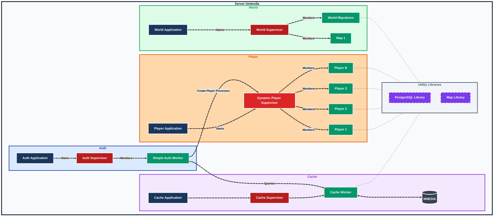
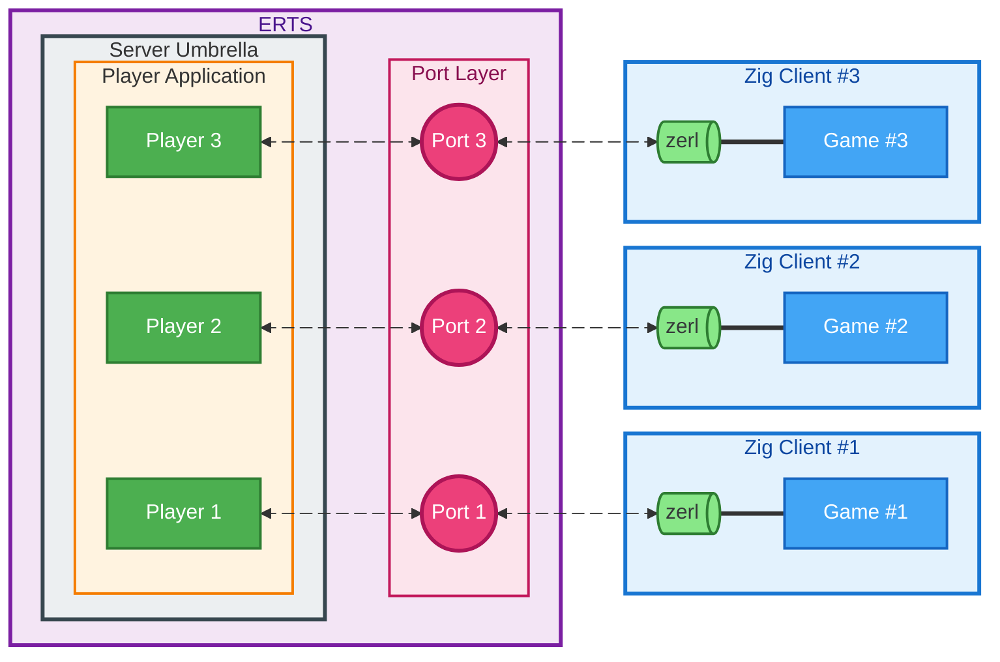

# Erlang Server

- [Erlang Server](#erlang-server)
  - [Architecture](#architecture)
    - [Client/Server Communication](#clientserver-communication)
  - [Shell](#shell)

## Architecture

- Our server is a [Multi-App Project](https://adoptingerlang.org/docs/development/umbrella_projects/) consisting of smaller [OTP Applications](https://www.erlang.org/doc/system/applications.html) (each managining its own supervision trees and worker processes) or libraries.
- Each Player is an Erlang Process, which are all monitored by a single supervisor.



### Client/Server Communication

We leverage [Zerl](https://github.com/dont-rely-on-nulls/zerl) to enable communication between the Zig Client and our Erlang server. 



## Shell

To spawn a local `rebar shell`, first make sure to generate a release (we need this to make sure the migration files are properly setup as well).

```bash
cd server
rebar3 release as default
rebar3 shell
# Now inside the rebar3 shell, you can run observer
> observer:start().
```
