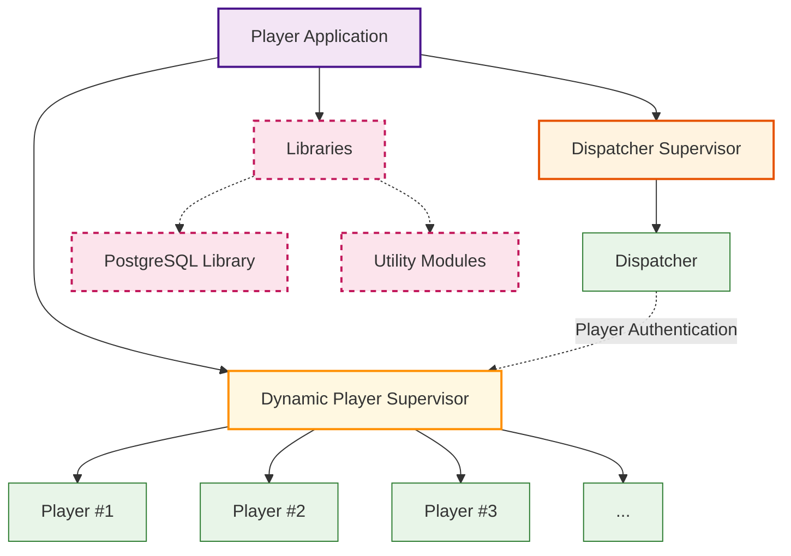

# Erlang Server

- [Erlang Server](#erlang-server)
  - [Architecture](#architecture)
    - [World Application](#world-application)
    - [Player Application](#player-application)
    - [MNESIA Storage](#mnesia-storage)
    - [Utilities Modules](#utilities-modules)

## Architecture

### World Application

### Player Application

### MNESIA Storage

### Utilities Modules
