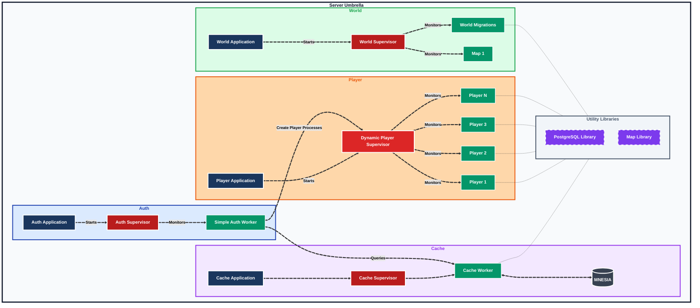
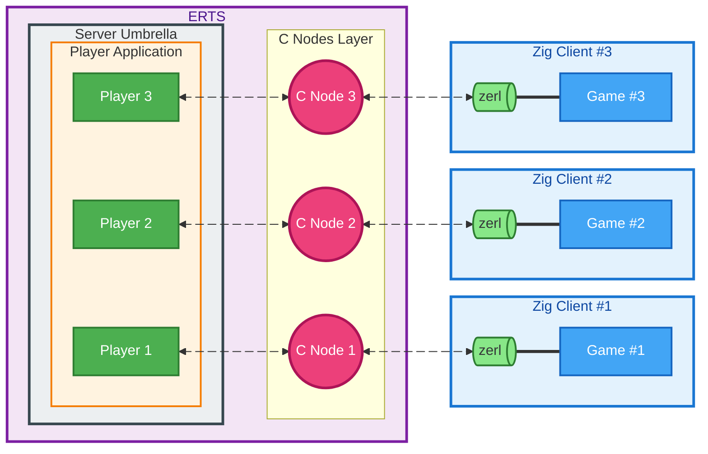

# Erlang Server

- [Erlang Server](#erlang-server)
  - [Architecture](#architecture)
    - [Client/Server Communication](#clientserver-communication)
  - [Shell](#shell)

## Architecture

- Our server is a [Multi-App Project](https://adoptingerlang.org/docs/development/umbrella_projects/) consisting of smaller [OTP Applications](https://www.erlang.org/doc/system/applications.html) (each managining its own supervision trees and worker processes) or libraries.
- Each Player is an Erlang Process, which are all monitored by a single supervisor.


```mermaid
graph TD
    subgraph Server[Server Umbrella]
        subgraph "Auth"
            AA[Auth Application]
            AS[Auth Supervisor]
            SAW[Simple Auth Worker]
            AA aa_as@==>|Starts| AS
            AS as_saw@==>|Monitors| SAW

            aa_as@{animation: slow}
            as_saw@{animation: fast}
        end
        
        subgraph "World"
            WA[World Application]
            WS[World Supervisor]
            WM[World Migrations]
            WM1[Map 1]
            WA wa_ws@==>|Starts| WS
            WS ws_wm@==>|Monitors| WM
            WS ws_wm1@==>|Monitors| WM1

            wa_ws@{animation: slow}
            ws_wm@{animation: fast}
            ws_wm1@{animation: fast}
        end

        subgraph "Player"
            PA[Player Application]
            DPS[Dynamic Player Supervisor]
            P1[Player 1]
            P2[Player 2]
            P3[Player 3]
            PN[Player N]
            PA pa_dps@==>|Starts| DPS
            DPS dps_p1@==>|Monitors| P1
            DPS dps_p2@==>|Monitors| P2
            DPS dps_p3@==>|Monitors| P3
            DPS dps_p4@==>|Monitors| PN

            pa_dps@{animation: slow}
            dps_p1@{animation: fast}
            dps_p2@{animation: fast}
            dps_p3@{animation: fast}
            dps_p4@{animation: fast}
        end

        subgraph "Cache"
            CA[Cache Application]
            CS[Cache Supervisor]
            CW[Cache Worker]
            MNESIA@{ shape: cyl }
            CA ca_cs@==> CS
            CS cs_cw@==> CW
            CW cw_mnesia@<==> MNESIA

            ca_cs@{animation: slow}
            cs_cw@{animation: fast}
            cw_mnesia@{animation: fast}
        end
        
        subgraph Libraries[Utility Libraries]
            LPG[PostgreSQL Library]
            LMAP[Map Library]
        end
    end
    
    %% Inter-application connections
    SAW saw_dps@==>|Create Player Processes| DPS
    SAW saw_cw@==>|Queries| CW
    CW -.- Libraries
    P1 & P2 & P3 & PN -.- Libraries
    WM -.- Libraries

    saw_dps@{animation: fast}
    saw_cw@{animation: fast}
    
    %% Node & Edges
    classDef app fill:#1a365d,color:#ffffff,stroke:#ffffff,stroke-width:3px,font-weight:bold
    classDef supervisor fill:#b91c1c,color:#ffffff,stroke:#ffffff,stroke-width:3px,font-weight:bold
    classDef dynamicSup fill:#dc2626,color:#ffffff,stroke:#ffffff,stroke-width:3px,font-weight:bold
    classDef process fill:#059669,color:#ffffff,stroke:#ffffff,stroke-width:2px,font-weight:bold
    classDef library fill:#7c3aed,color:#ffffff,stroke:#ffffff,stroke-width:3px,stroke-dasharray: 8 8,font-weight:bold
    classDef database fill:#374151,color:#ffffff,stroke:#ffffff,stroke-width:3px,font-weight:bold

    classDef edgeLabel fill:#ffffff,color:#000000,stroke:#000000,stroke-width:2px,font-weight:bold,font-size:14px
    
    %% Subgraph Backgrounds
    classDef authBg fill:#dbeafe,stroke:#1e40af,stroke-width:3px,color:#1e40af,font-weight:bold
    classDef worldBg fill:#dcfce7,stroke:#16a34a,stroke-width:3px,color:#16a34a,font-weight:bold
    classDef playerBg fill:#fed7aa,stroke:#ea580c,stroke-width:3px,color:#ea580c,font-weight:bold
    classDef cacheBg fill:#f3e8ff,stroke:#9333ea,stroke-width:3px,color:#9333ea,font-weight:bold
    classDef utilityBg fill:#f1f5f9,stroke:#475569,stroke-width:3px,color:#475569,font-weight:bold
    classDef serverBg fill:#f8fafc,stroke:#0f172a,stroke-width:4px,color:#0f172a,font-weight:bold

    %% Styling
    class AA,WA,PA,CA app
    class AS,WS,CS supervisor
    class DPS dynamicSup
    class CW,P1,P2,P3,PN,SAW,WM,WM1 process
    class LPG,LMAP library
    class MNESIA database
    
    class Auth authBg
    class World worldBg
    class Player playerBg
    class Cache cacheBg
    class Libraries utilityBg
    class Server serverBg
```

### Client/Server Communication

We leverage [Zerl](https://github.com/dont-rely-on-nulls/zerl) to enable communication between the Zig Client and our Erlang server. 


```mermaid
graph LR
    subgraph Client1[Zig Client #1]
        Game1[Game #1]
        Zerl1@{ shape: das, label: "zerl" }

        Zerl1 === Game1
    end

    subgraph Client2[Zig Client #2]
        Game2[Game #2]
        Zerl2@{ shape: das, label: "zerl" }

        Zerl2 === Game2
    end

    subgraph Client3[Zig Client #3]
        Game3[Game #3]
        Zerl3@{ shape: das, label: "zerl" }

        Zerl3 === Game3
    end
    
    subgraph BEAM[ERTS]
        subgraph Server["Server Umbrella"]
            subgraph Player[Player Application]
                P1[Player 1]
                P2[Player 2]
                P3[Player 3]
            end
        end

        subgraph CNodes["C Nodes Layer"]
            CN1((C Node 1))
            CN2((C Node 2))
            CN3((C Node 3))
        end
        
        P1 p1_pt1@<--> CN1
        P2 p2_pt2@<--> CN2
        P3 p3_pt3@<--> CN3

        p1_pt1@{animation: "fast"}
        p2_pt2@{animation: "fast"}
        p3_pt3@{animation: "fast"}
    end

    CN1 pt1_z@<--> Zerl1
    CN2 pt2_z@<--> Zerl2
    CN3 pt3_z@<--> Zerl3

    pt1_z@{animation: "fast"}
    pt2_z@{animation: "fast"}
    pt3_z@{animation: "fast"}
    
    %% Styling

    class Player playerBg
    class Server serverBg

    class P1,P2,P3 process
    class CN1,CN2,CN3 cnode

    %% Enhanced Styling
    classDef clientBg fill:#e3f2fd,stroke:#1976d2,stroke-width:3px,color:#0d47a1
    classDef beamBg fill:#f3e5f5,stroke:#7b1fa2,stroke-width:3px,color:#4a148c
    classDef CNodeBg fill:#fce4ec,stroke:#c2185b,stroke-width:2px,color:#880e4f
    classDef playerBg fill:#FFF3E0,stroke:#F57C00,stroke-width:2px
    classDef serverBg fill:#ECEFF1,stroke:#37474F,stroke-width:3px

    classDef gameNode fill:#42a5f5,stroke:#1565c0,stroke-width:2px,color:#ffffff
    classDef zerlNode fill:#88E788,stroke:#2e7d32,stroke-width:2px,color:#353839
    classDef playerNode fill:#ff9800,stroke:#ef6c00,stroke-width:2px,color:#ffffff
    classDef process fill:#4CAF50,color:#ffffff,stroke:#2E7D32,stroke-width:2px
    classDef cNode fill:#ec407a,stroke:#ad1457,stroke-width:3px,color:#ffffff
    
    %% Apply classes to subgraphs and nodes
    class Client1,Client2,Client3 clientBg
    class BEAM beamBg
    class Server serverBg
    class Player playerBg
    class CNode CNodeBg
    
    class Game1,Game2,Game3 gameNode
    class Zerl1,Zerl2,Zerl3 zerlNode
    class P1,P2,P3 process
    class CN1,CN2,CN3 cNode
```

## Shell

To spawn a local `rebar shell`, first make sure to generate a release (we need this to make sure the migration files are properly setup as well).

```bash
cd server
rebar3 release as default
rebar3 shell
# Now inside the rebar3 shell, you can run observer
> observer:start().
```

## Database Access

PostgreSQL access goes through [pgo](https://github.com/erleans/pgo) connection pools owned by the `database` OTP application. Three named pools cover the privilege boundary between subsystems:

| Pool          | Role env vars                              | Used by                          |
| ------------- | ------------------------------------------ | -------------------------------- |
| `lyceum_pool` | `PGUSER` / `PGPASSWORD` (`application`)    | `player`, `character`, `map`     |
| `auth_pool`   | `PG_AUTH_USER` / `PG_AUTH_PASSWORD`        | `simple_auth`, `registry`        |
| `mnesia_pool` | `PG_MNESIA_USER` / `PG_MNESIA_PASSWORD`    | reserved for `cache`             |

Pool sizes are tunable from [`config/sys.config`](config/sys.config) under the `database` application's `pools` env. The pools are started by `database_sup` at boot, before `auth`, `player`, `cache`, or `world` start, so queries never race the pool startup.

Every query goes through `database:query/2,3` and `database:transaction/2`; modules pass the pool atom rather than a connection. There are no per-session PostgreSQL connections: the number of backends to Postgres is bounded by `pool_size` regardless of player count.

### Migration boot path

`migraterl` is still hardcoded against `epgsql`, so `world:init/1` opens a single short-lived `epgsql` connection (`PG_MIGRATERL_USER` / `PG_MIGRATERL_PASSWORD`), runs migrations through `migraterl:migrate/3`, and immediately closes it via `database:close_migrator_connection/1`. This is the only `epgsql` call site that survives in our code; everything else runs through `pgo`.
