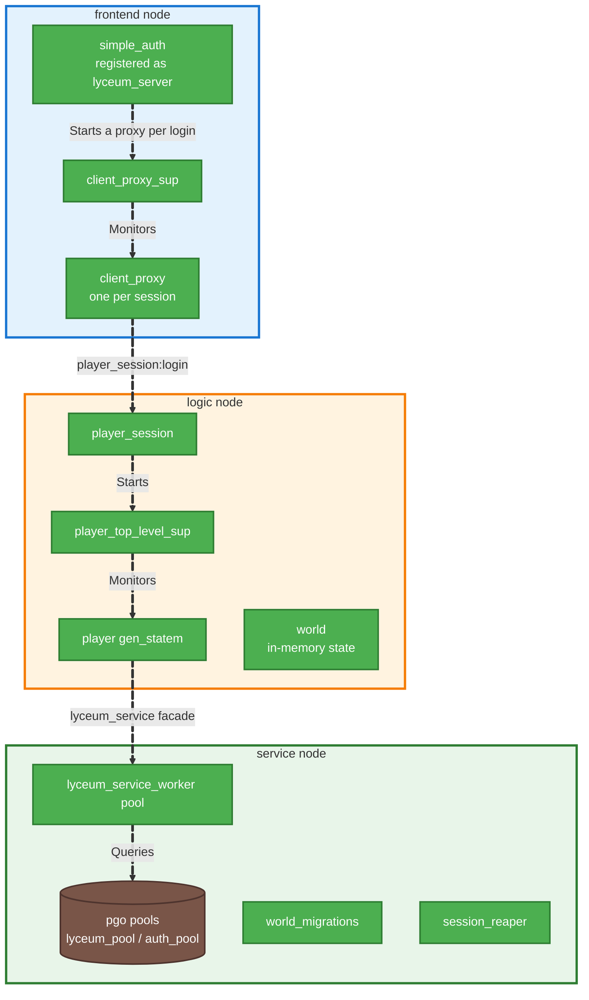
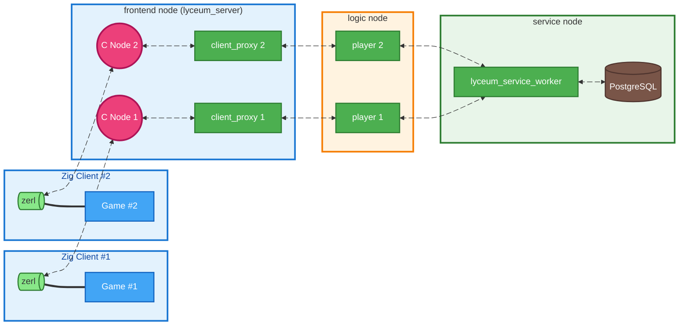

# Erlang Server

- [Erlang Server](#erlang-server)
  - [Architecture](#architecture)
    - [The three layers](#the-three-layers)
    - [Client/Server Communication](#clientserver-communication)
    - [Login and session flow](#login-and-session-flow)
  - [Shell](#shell)
  - [Database Access](#database-access)
    - [Migration boot path](#migration-boot-path)
    - [Temporal tables](#temporal-tables)

## Architecture

Our server is a [Multi-App Project](https://adoptingerlang.org/docs/development/umbrella_projects/) of smaller [OTP Applications](https://www.erlang.org/doc/system/applications.html), each managing its own supervision tree.

It runs as **three node types**: `frontend`, `logic` and `service`, with calls only ever travelling downward. This follows closed the idea propposed by Francesco Cessari in [Designing for Scalability with Erlang/OTP: Implement Robust, Fault-Tolerant Systems](https://www.amazon.com/Designing-Scalability-Erlang-OTP-Fault-Tolerant/dp/1449320732). There is still exactly one release: every application is present on every node and what differs is the `node_types` configuration. Each supervisor filters its own children in `init/1`:

```erlang
Children = [Spec || {Layer, Spec} <- Specs, lyceum_cluster:hosts_layer(Layer)],
```

so a node that does not host a layer boots that layer's supervisor empty. `LYCEUM_NODE_TYPES=frontend,logic,service` is the all-in-one node that `just server` runs and that development assumes.

Discovery is `pg` (scope `lyceum`), never `global`, and nodes run with `-kernel connect_all false`. That combination is what makes the layering structural rather than a convention: `pg` syncs only across directly connected, visible nodes and never relays, so a frontend node linked only to logic *cannot see* the service groups even when both are up.

### The three layers


```mermaid
graph TD
    subgraph Frontend["frontend node"]
        SA[simple_auth<br/>registered as lyceum_server]
        CPS[client_proxy_sup]
        CP1[client_proxy<br/>one per session]

        SA sa_cps@==>|Starts a proxy per login| CPS
        CPS cps_cp@==>|Monitors| CP1
        sa_cps@{animation: slow}
        cps_cp@{animation: fast}
    end

    subgraph Logic["logic node"]
        PS[player_session]
        PTS[player_top_level_sup]
        P1[player gen_statem]
        W[world<br/>in-memory state]

        PS ps_pts@==>|Starts| PTS
        PTS pts_p@==>|Monitors| P1
        ps_pts@{animation: slow}
        pts_p@{animation: fast}
    end

    subgraph Service["service node"]
        LSW[lyceum_service_worker pool]
        POOLS[(pgo pools<br/>lyceum_pool / auth_pool)]
        WM[world_migrations]
        SR[session_reaper]

        LSW lsw_pools@==>|Queries| POOLS
        lsw_pools@{animation: fast}
    end

    CP1 cp_ps@==>|player_session:login| PS
    P1 p_lsw@==>|lyceum_service facade| LSW
    cp_ps@{animation: fast}
    p_lsw@{animation: fast}

    classDef process fill:#4CAF50,color:#ffffff,stroke:#2E7D32,stroke-width:2px
    classDef database fill:#795548,color:#ffffff,stroke:#4E342E,stroke-width:2px
    classDef frontendBg fill:#E3F2FD,stroke:#1976D2,stroke-width:3px
    classDef logicBg fill:#FFF3E0,stroke:#F57C00,stroke-width:3px
    classDef serviceBg fill:#E8F5E9,stroke:#2E7D32,stroke-width:3px

    class SA,CPS,CP1,PS,PTS,P1,W,LSW,WM,SR process
    class POOLS database
    class Frontend frontendBg
    class Logic logicBg
    class Service serviceBg
```

Applications under `apps/`, in boot order: `lyceum_cluster` -> `database` -> `lib_map` -> `cache` -> `lyceum_service` -> `world` -> `player` -> `auth`.

- **`lyceum_cluster`**: membership and discovery. Workers register with `lyceum_cluster:join/1`, callers reach one with `lyceum_cluster:call/3`, which owns the cross-layer policy (local members win, one re-pick on a stale pid, dropped connections become error values). Never hardcode node names.
- **`lyceum_service`**: The only way anything reaches the database. `lyceum_service.erl` is the caller-side facade, `lyceum_service_worker` processes run on `service` nodes and execute the SQL locally, which is what keeps `pgo` transactions on the pool's node. Failures come back as values, i.e. `{error, no_service | service_timeout | Reason}`, never as exceptions.
- **`database`**: The `pgo` pools, started only on `service` nodes.
- **`world`**: Spans two layers: `world_migrations` (service) runs migrations at boot, the `world` worker (logic) is pure in-memory state.
- **`auth`** (frontend): `simple_auth` is a thin dispatcher that turns a client's first message into a `client_proxy` and is never spoken to again.
- **`player`** (logic): `player_session` performs logins and spawns one `player` `gen_statem` per session.
- **`cache`** (service): the session store. No longer a process, sessions live in `player.session` and the module runs inside the calling service worker. `session_reaper` closes sessions whose logic node died.
- **`lib_map`**: map/terrain library.

### Client/Server Communication

We leverage [Zerl](https://github.com/dont-rely-on-nulls/zerl) to enable communication between the Zig Client and our Erlang server.

The client holds **exactly one distribution connection**, to `lyceum_server@<host>`, and Erlang distribution does not relay. Every pid the client is handed must therefore live on the frontend node, which is why a login returns a `client_proxy` pid rather than the player's: the proxy is a per-session gateway on the frontend that relays in both directions. The client is unchanged by this, the reply is still `{ok, {Pid, Email}}` and it treats the pid as opaque.


```mermaid
graph LR
    subgraph Client1[Zig Client #1]
        Game1[Game #1]
        Zerl1@{ shape: das, label: "zerl" }
        Zerl1 === Game1
    end

    subgraph Client2[Zig Client #2]
        Game2[Game #2]
        Zerl2@{ shape: das, label: "zerl" }
        Zerl2 === Game2
    end

    subgraph FrontendNode["frontend node (lyceum_server)"]
        CN1((C Node 1))
        CN2((C Node 2))
        CP1[client_proxy 1]
        CP2[client_proxy 2]

        CN1 cn1_cp1@<--> CP1
        CN2 cn2_cp2@<--> CP2
        cn1_cp1@{animation: "fast"}
        cn2_cp2@{animation: "fast"}
    end

    subgraph LogicNode["logic node"]
        P1[player 1]
        P2[player 2]
    end

    subgraph ServiceNode["service node"]
        LSW[lyceum_service_worker]
        DB[(PostgreSQL)]
        LSW lsw_db@<--> DB
        lsw_db@{animation: "fast"}
    end

    Zerl1 z1_cn1@<--> CN1
    Zerl2 z2_cn2@<--> CN2
    CP1 cp1_p1@<--> P1
    CP2 cp2_p2@<--> P2
    P1 p1_lsw@<--> LSW
    P2 p2_lsw@<--> LSW

    z1_cn1@{animation: "fast"}
    z2_cn2@{animation: "fast"}
    cp1_p1@{animation: "fast"}
    cp2_p2@{animation: "fast"}
    p1_lsw@{animation: "fast"}
    p2_lsw@{animation: "fast"}

    classDef clientBg fill:#e3f2fd,stroke:#1976d2,stroke-width:3px,color:#0d47a1
    classDef frontendBg fill:#E3F2FD,stroke:#1976D2,stroke-width:3px
    classDef logicBg fill:#FFF3E0,stroke:#F57C00,stroke-width:3px
    classDef serviceBg fill:#E8F5E9,stroke:#2E7D32,stroke-width:3px
    classDef gameNode fill:#42a5f5,stroke:#1565c0,stroke-width:2px,color:#ffffff
    classDef zerlNode fill:#88E788,stroke:#2e7d32,stroke-width:2px,color:#353839
    classDef process fill:#4CAF50,color:#ffffff,stroke:#2E7D32,stroke-width:2px
    classDef cNode fill:#ec407a,stroke:#ad1457,stroke-width:3px,color:#ffffff
    classDef database fill:#795548,color:#ffffff,stroke:#4E342E,stroke-width:2px

    class Client1,Client2 clientBg
    class FrontendNode frontendBg
    class LogicNode logicBg
    class ServiceNode serviceBg
    class Game1,Game2 gameNode
    class Zerl1,Zerl2 zerlNode
    class CP1,CP2,P1,P2,LSW process
    class CN1,CN2 cNode
    class DB database
```

### Login and session flow

`client -> simple_auth (frontend) -> client_proxy (frontend) -> player_session (logic) -> player (logic) -> lyceum_service (service)`

The proxy relays client messages to the player verbatim and unwraps `{reply, Msg}` coming back. It monitors the player and the client's node, the player monitors the proxy and, on its death, deactivates the character.

A duplicate login is a **takeover**: the service layer returns the previous session's proxy pid, which gets kicked. Rejecting the second login instead would let a crashed client lock a player out of their own account until the session was reaped, so the new login wins.

## Shell

To spawn a local `rebar shell`, first make sure to generate a release (we need this to make sure the migration files are properly setup as well).

```bash
cd server
rebar3 release as default
rebar3 shell
# Now inside the rebar3 shell, you can run observer
> observer:start().
```

## Database Access

PostgreSQL access goes through [pgo](https://github.com/erleans/pgo) connection pools owned by the `database` OTP application. Two named pools cover the privilege boundary between subsystems:

| Pool          | Role env vars                              | Used by                          |
| ------------- | ------------------------------------------ | -------------------------------- |
| `lyceum_pool` | `PGUSER` / `PGPASSWORD` (`application`)    | `character`, `map`, `cache`      |
| `auth_pool`   | `PG_AUTH_USER` / `PG_AUTH_PASSWORD`        | `registry`                       |

(A third `mnesia` role still exists in `000002_roles.sql` and in the Nix Postgres setup. It is vestigial -- nothing uses it now that sessions are in PostgreSQL -- and is left alone because removing it means editing an already-applied `once` migration.)

Both pools live **only on `service` nodes**: `database_sup` asks `lyceum_cluster:hosts_layer(service)` and starts nothing anywhere else, so a frontend or logic node never opens a connection to PostgreSQL. Everything above the service layer reaches the database through `lyceum_service`, whose workers run the queries where the pools are.

Pool sizes are tunable from [`config/sys.config.src`](config/sys.config.src) under the `database` application's `pools` env. The pools are started by `database_sup` at boot, before `lyceum_service`, `world`, `player`, or `auth` start, so queries never race the pool startup.

Every query goes through `database:query/2,3` and `database:transaction/2`; modules pass the pool atom rather than a connection. There are no per-session PostgreSQL connections: the number of backends to Postgres is bounded by `pool_size` regardless of player count.

### Migration boot path

`migraterl` is still hardcoded against `epgsql`, so `world_migrations:handle_continue/2` opens a single short-lived `epgsql` connection (`PG_MIGRATERL_USER` / `PG_MIGRATERL_PASSWORD`), runs the four namespaces in order (`main` -> `repeatable` -> `init` -> `test`), and closes it. This is the only `epgsql` call site that survives in our code; everything else runs through `pgo`.

**Several service nodes may boot at once.** Three things make that safe, and they are worth keeping straight:

1. `world_migrations` takes a **cluster-wide** advisory lock (`database:lock_migrations/1`) around the entire pass. This is the one that matters on a *fresh* database: migraterl creates its journal with `CREATE SCHEMA IF NOT EXISTS` before it can take any lock of its own, and that is not atomic against a concurrent creator, two nodes both pass the existence check and the loser dies on `pg_namespace`'s unique index. It is session-level rather than transaction-level because migraterl runs its own transactions on that connection.
2. migraterl then takes a **per-namespace** `pg_advisory_lock` across planning and applying, so a node that arrives later finds nothing left to do.
3. Seeding the maps through `map_generator` happens outside both, and carries its own protection: every insert is `ON CONFLICT DO NOTHING`.

`world_migrations_SUITE` runs concurrent passes and asserts all of it, every script journalled once, no duplicated seed rows, and it is worth running against a *dropped* schema, since the journal-bootstrap race only appears when the journal does not exist yet.

Before seeding, the runner waits for the `pgo` pool to actually answer a query. The pool's supervisor returns as soon as it starts but its connections are established asynchronously, so `lyceum_pool` can exist while every query through it comes back `none_available`. Giving up is a value, folded into the same backoff used for an unreachable database, not a crash.

### Temporal tables

Three tables record *when* something was true rather than only what is true now, using PostgreSQL 18's `WITHOUT OVERLAPS` (hence `btree_gist` in `000001_schemas.sql`):

| Table                 | A period means                        | The constraint buys                                     |
| --------------------- | ------------------------------------- | ------------------------------------------------------- |
| `player.session`      | a player was logged in                | one live session per player, plus login history          |
| `character.active`    | a character was in the world          | one presence per character, plus playtime                |
| `equipment.equipped`  | an item was worn in a slot            | one item per slot at a time, plus what was worn when     |

The shape is the same in all three:

- An open period is `upper(valid_at) = 'infinity'`, closing one sets the upper bound to `clock_timestamp()`, and rows are **closed, never deleted**.
- The upper bound is a real `'infinity'` rather than an unbounded (NULL) one, so "still open" is a value in the domain.
- Bounds are `clock_timestamp()` and never `now()`. `now()` is the *transaction's* start time, so a transaction that began earlier but committed later would close a period with an upper bound below its own lower bound, which PostgreSQL rejects outright.

`player.session` is what lifted the one-service-node limit. The invariant "a player has at most one live session" used to be enforced structurally, by there being exactly one `cache` gen_server to ask, with the session in a shared table the exclusion constraint enforces it instead, no matter which service node answers. A per-player `pg_advisory_xact_lock` serialises the writers on the way in. Note that `pg_advisory_xact_lock` returns `void`, which `pgo` cannot decode, so the call is wrapped in a subselect that yields a real column.
